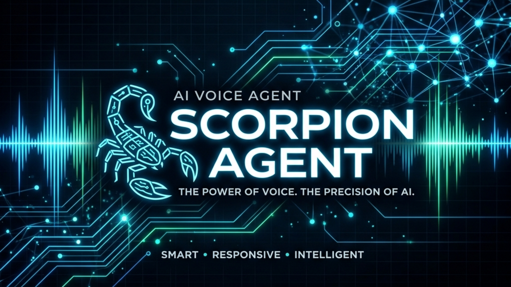

<p align="center">
  
</p>

# ScorpionAgent

A highly intelligent, locally-hosted AI Voice Agent utilizing `llamacpp`, `whisper.cpp`, and `piper` for incredibly fast real-time interaction. It comes with a beautiful, dark-themed dashboard written in React (Vite + Tailwind CSS).

## Features
- **Local AI Power:** Uses local large language models via `llamacpp`.
- **Fast Voice Processing:** Near instant speech-to-text with `whisper.cpp`.
- **High-Quality TTS:** Generates beautiful text-to-speech with `piper`.
- **Admin Dashboard:** Monitor hardware utilization, adjust models, and view memory graphs in real-time.
- **Client Management:** The agent stores contextual memory graphs per-client for hyper-personalized conversations.

## Quick Start

1. Start the Go Server:
   ```bash
   go run cmd/server/main.go
   ```

2. Start the Frontend Dashboard:
   ```bash
   cd web
   npm install
   npm run dev
   ```

## License
Private Repository.
